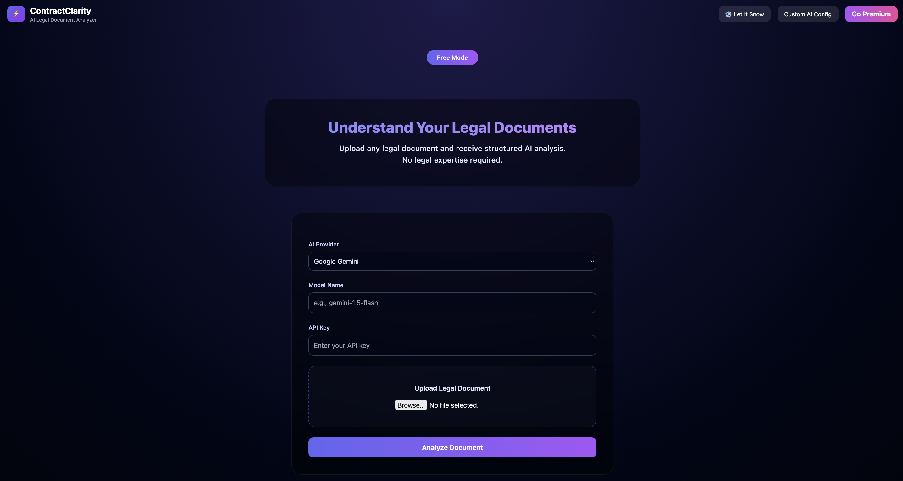

# ContractClarity | AI-Powered Legal Document Simplifier 

  

**ContractClarity** is a powerful, privacy-first web application that simplifies complex legal documents using AI. It identifies risks, summarizes key clauses, and provides actionable advice without storing your data.



## 🌟 Features

- **Dual Mode Analysis**:
  - **Free Mode**: Bring your own API Key (Google Gemini).
  - **Premium Mode**: Use the server-side managed API key for instant access.
- **Advanced AI Analysis**: Powered by **Google Gemini 1.5 Flash** for deep legal insight.
- **Rule-Based Fallback**: Intelligent regex-based analysis system that works even without an API key.
- **Smart Risk Scoring**: Instantly calculates a risk score (0-100) based on specific legal keywords.
- **Clause Highlighting**: Automatically highlights risky clauses in PDFs for quick review.
- **Privacy-First Architecture**: 
  - **Zero Persistence**: Documents are processed in-memory and immediately discarded.
  - **No Database**: No user tracking or data storage.
- **Rich UI/UX**: 
  - Modern Glassmorphism design.
  - Interactive "Snow" effect.
  - Responsive Tailwind CSS layout.
- **Format Support**: Handles `.pdf`, `.docx`, `.txt`, and Images seamlessly.


## 🏗️ Project Structure

```
ContractClarity/
├── app.py                 # Main Flask application entry point
├── analyzer.py            # AI integration (Google Gemini) logic
├── rule_based.py          # Regex-based fallback analysis logic
├── highlighter.py         # PDF clause highlighting logic
├── templates/
│   └── index.html         # Single-page application logic (HTML/JS)
├── static/
│   └── (Static assets)
├── uploads/               # Temporary folder for file processing
├── requirements.txt       # Python dependencies
├── Procfile               # Deployment configuration (Gunicorn)
└── README.md              # Project documentation
```

## 🛠️ Technology Stack

### Backend
- **Python**: Core logic.
- **Flask**: Web framework.
- **Google Generative AI**: LLM for document analysis.
- **PDFPlumber**: Robust PDF text extraction.
- **PyMuPDF (fitz)**: High-performance PDF maniuplation and highlighting.
- **python-docx**: Word document processing.
- **RegEx**: Fallback pattern matching.

### Frontend
- **HTML5 / JavaScript**: Vanilla JS for upload logic and interactivity.
- **Tailwind CSS**: Styling and responsive design.
- **CSS Animations**: Custom keyframes for snow and glass effects.

## 🔒 Privacy & Security

**Your documents are completely private:**
- ✅ **In-Memory Processing**: Files are read into memory and processed.
- ✅ **Immediate Deletion**: Uploaded files are deleted from the disk immediately after analysis.
- ✅ **No Database**: It does not store summaries, logs, or user data.
